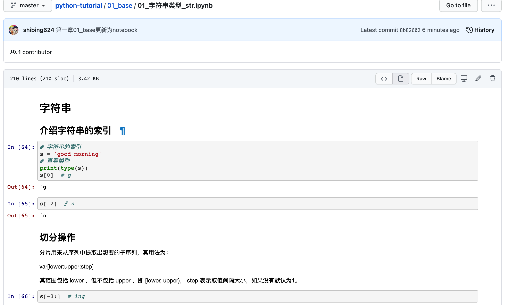

# python-tutorial

[](CONTRIBUTING.md)
[](https://github.com/shibing624/python-tutorial/graphs/contributors)
[](LICENSE)
[](requirements.txt)
[](https://github.com/shibing624/python-tutorial/issues)
[](#Contact)


Python实用教程，包括：Python基础，Python高级特性，面向对象编程，多线程，数据库，数据科学，Flask，爬虫开发教程。


在本Python教程包含了一些范例，涵盖了大多数Python日常脚本任务，是入门Python的学习资料，也可以作为工作中编写Python脚本的参考实现。
以下所有实现均在python3环境下测试。


**Guide**

- [Tutorial](#python-tutorial的例子清单)
- [Get Started](#get-started)
- [Contact](#Contact)
- [Cite](#Cite)
- [Reference](#reference)


# python-tutorial的例子清单

| **目录**  | **主题**            | 简要说明                              |
| --------------------- | -------------------------------------------- | ---------------------------- |
| [01_base](01_base)       | Python基础    | 提供了数据类型、字符串、list、条件判断、循环、函数、文件、多进程的使用例子。 |
| [02_advanced](02_advanced)       | Python高级特性    | 提供了数据库、高阶函数、迭代器、面向对象编程的使用例子。 |
| [03_data_science](03_data_science)    | 数据科学 | 提供了常用数据科学库（numpy、scipy、scikit-learn、pandas）的使用例子。 |
| [04_flask](04_flask)      | Flask开发    | 提供了Web框架Flask的使用例子。 |
| [05_spider](05_spider) | 爬虫    | 提供了网络爬虫的实现例子。|
| [06_tool](06_tool) | 实用工具    | 提供了常用的实用工具，包括参数解析、日志工具等例子。|


# Get Started

教程代码大多数为Jupyter Notebook书写（文件后缀.ipynb），如下所示：


使用Jupyter Notebook打开学习：
1. 下载Python：建议使用Anaconda，Python环境和包一键装好，[Python3.7 版本](https://www.anaconda.com/products/individual)
2. 下载本项目：可以使用`git clone`，或者下载zip文件，解压到电脑
3. 打开Jupyter Notebook：打开终端，`cd`到本项目所在的文件夹，执行：```jupyter notebook ```，浏览器打开`01_base/01_字符串类型.ipynb`，跟随介绍交互使用

# Contact

- Issue(建议)：[](https://github.com/shibing624/python-tutorial/issues)
- 邮件我：xuming: xuming624@qq.com
- 微信我：加我*微信号：xuming624*, 进Python-NLP交流群，备注：*姓名-公司名-NLP*


读后有疑问请加微信群讨论，读后有收获可以打赏作者喝咖啡：


# Cite

如果你在研究中使用了python-tutorial，请按如下格式引用：

```latex
@software{python-tutorial,
  author = {Xu Ming},
  title = {python-tutorial: Python3 Tutorial for Beginners},
  year = {2021},
  url = {https://github.com/shibing624/python-tutorial},
}
```

# License


授权协议为 [The Apache License 2.0](/LICENSE)，可免费用做商业用途。请在产品说明中附加python-tutorial的链接和授权协议。


# Contribute
项目代码还很粗糙，如果大家对代码有所改进，欢迎提交回本项目，在提交之前，注意以下两点：

 - 在本地进行单元测试
 - 确保所有单测都是通过的

之后即可提交PR。

# Reference

1. [缪雪峰Python3教程](https://www.liaoxuefeng.com/wiki/1016959663602400)
2. [PythonDataScienceHandbook](https://github.com/jakevdp/PythonDataScienceHandbook)
3. [Python4DataScience.CH](https://github.com/catalystfrank/Python4DataScience.CH)
4. [Python-100-Days](https://github.com/jackfrued/Python-100-Days)
5. [flask-tutorial](https://github.com/greyli/flask-tutorial)